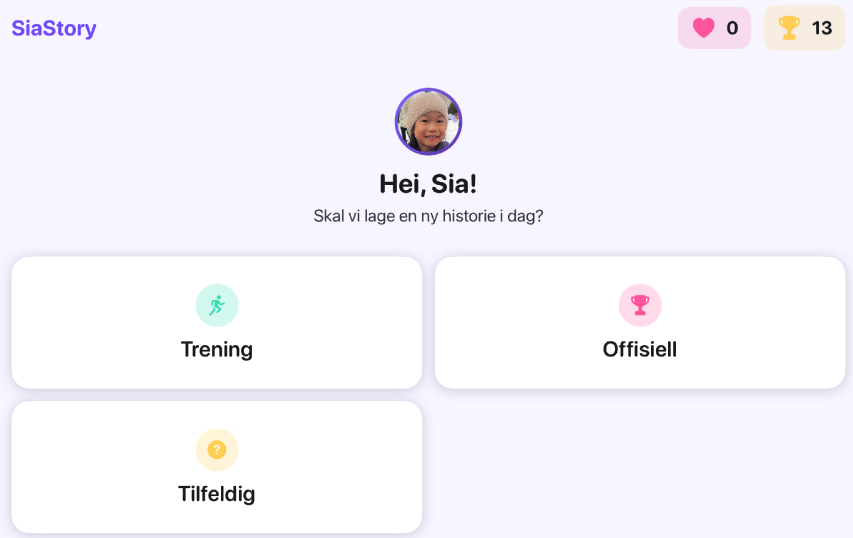
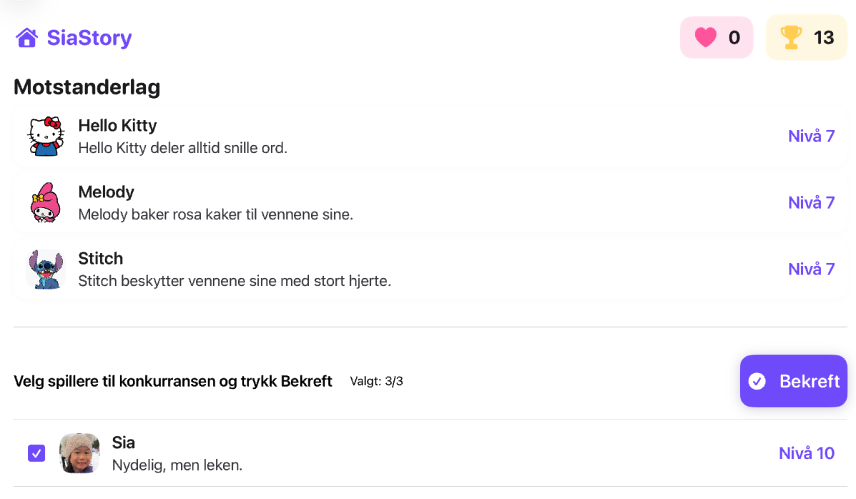
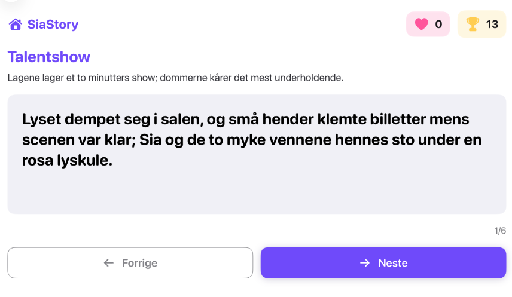
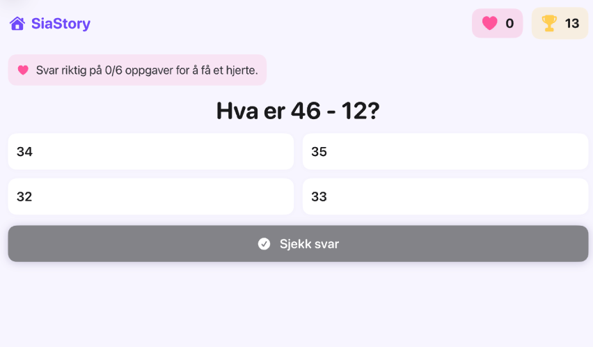

# SiaStory

SiaStory is an learning app for iPad built around my daughter, Sia, as the main character. Her favorite dolls, family members, and book characters form teams and compete in playful challenges. Each character has stored traits such as personality, strengths, favorite things, and weaknesses.

<table>
  <tr>
     <td></td>
     <td></td>
  </tr>
  <tr>
     <td></td>
     <td></td>
  </tr>
</table>

The player builds Sia's team and enters different competitions: cleaning the house, cooking pasta, ski relays, building snowmen, science fairs, treasure hunts, and many more. When a competition starts, the app sends the selected characters and competition details to the backend. An LLM then generates a short Norwegian story based on that exact matchup.

Even the same competition can produce a different story depending on the team composition. This makes the app replayable and gives Sia a reason to keep reading: she wants to know how her characters performed this time.

## How It Works

1. The player chooses a mode from the home screen: `Training`, `Official`, or `Random`.
2. The app prepares a matchup between Sia's team and an opponent team.
3. The app sends the competition metadata and character profiles to the backend API.
4. The backend builds a structured prompt and sends it to an LLM.
5. The app renders the generated story paragraph by paragraph.
6. At the end, the story clearly explains which team won and why.
7. If Sia's team wins, trophies and progress are updated.

## Learning Loop

Characters have levels. Higher-level characters are more likely to win competitions, but traits and team synergy also matter. A lower-level character can still shine if their strengths match the challenge.

To level up Sia's characters, the player goes to the training page and solves questions. The current training categories include:

- Addition, subtraction, multiplication, and division
- Mixed arithmetic
- Applied math word problems
- English
- Korean
- Science
- General knowledge

This creates the main learning loop: study to make the characters stronger, then use stronger characters to unlock better chances in story competitions.

## App Structure

SiaStory is organized around four main parts:

- **Character data**: Stores character names, short intros, background descriptions, and image references.
- **Competition data**: Stores competition names, team sizes, descriptions, and challenge-specific context.
- **SwiftUI app**: Provides the home screen, competition flow, story reader, training page, and settings.
- **Backend API**: Handles LLM story generation, progress sync, and question statistics.

## Tech Stack

- SwiftUI
- iOS 17+
- Node.js / Express backend
- OpenAI API for story generation
- Neon PostgreSQL for progress sync
- Local cache for offline-friendly progress handling

## Repository Note

This is a personal app and is not published on the App Store.
